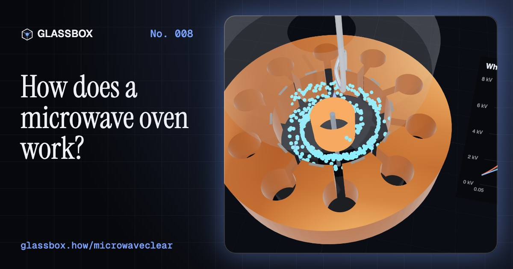
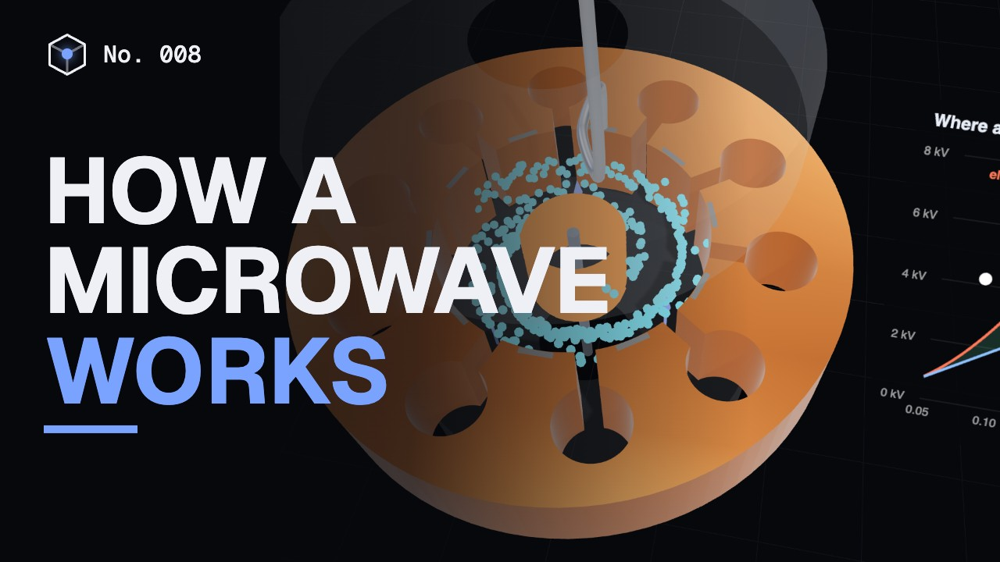
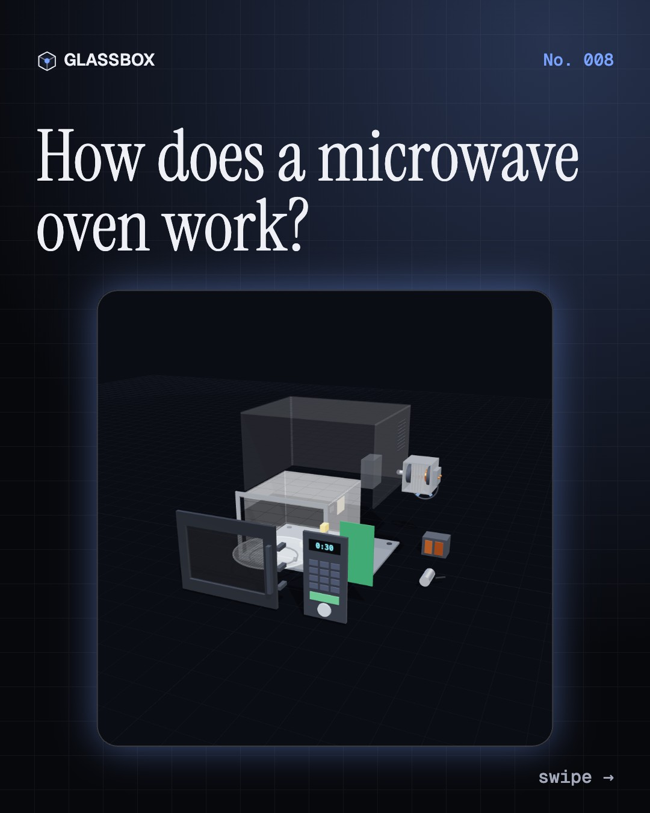
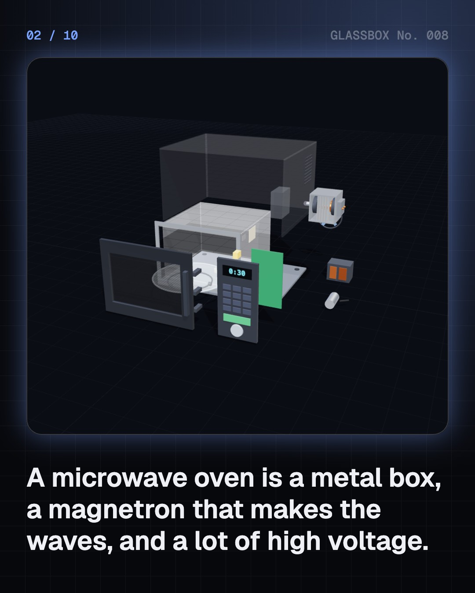
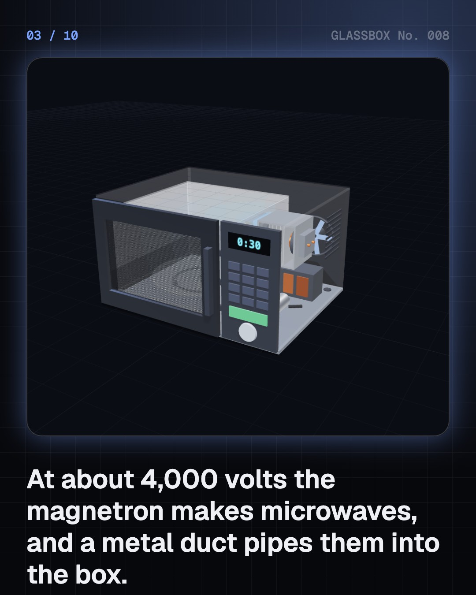
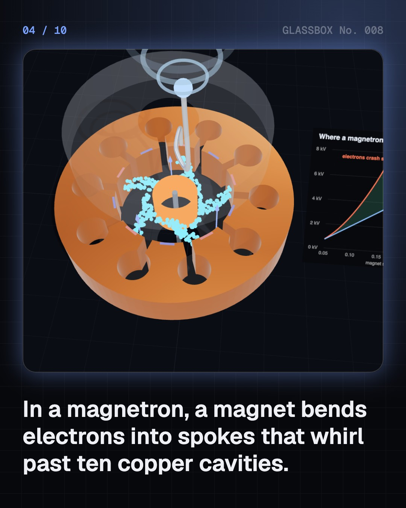

<!-- glassbox:start -->
<!-- Generated from glassbox.json by the Glassbox hub (npm run readme -- microwaveclear). Edit glassbox.json, not this block. -->
<p align="center"><a href="https://glassbox-production-fd52.up.railway.app/e/microwaveclear/"></a></p>

<h1 align="center">MicrowaveClear</h1>

<p align="center"><b>How does a microwave oven work?</b><br>A microwave oven is a radio transmitter in a metal box. Electrons whirl in a magnetron to make 12 cm waves that twist water molecules 2.45 billion times a second. Take one apart in 3D and find the hot spots.</p>

<p align="center"><a href="https://glassbox-production-fd52.up.railway.app/microwaveclear/"><b>▶ Play with it</b></a> &nbsp;·&nbsp; <a href="https://glassbox-production-fd52.up.railway.app/e/microwaveclear/">Read the 60-second explainer</a> &nbsp;·&nbsp; <a href="https://glassbox-production-fd52.up.railway.app/microwaveclear/glassbox/reel.mp4">Watch the 40-second video</a></p>

<p align="center">
  <a href="https://glassbox-production-fd52.up.railway.app/e/microwaveclear/"></a>
  <a href="https://glassbox-production-fd52.up.railway.app/e/microwaveclear/"></a>
  <a href="LICENSE"></a>
  <a href="LICENSE-CONTENT.md"></a>
  <a href="#privacy"></a>
</p>

## In 60 seconds

1. **A radio transmitter in a metal box.** A transformer, a capacitor and a diode turn mains electricity into about 4,000 volts. That powers a magnetron, which makes microwaves. A metal duct called the waveguide pipes them into the cooking box, whose metal walls bounce them around until the food soaks them up.
2. **Electrons whirling past copper cavities.** In the magnetron, electrons boil off a hot cathode and rush towards a copper anode. Strong magnets bend their paths so they swirl past ten little cavities, which ring like whistles 2.45 billion times a second. The waves are about 12.2 cm long, and about 65% of the power going in comes out as microwaves.
3. **Twisting water molecules.** Water molecules have a positive end and a negative end. The microwave field flips 2.45 billion times a second, twisting them back and forth against their neighbours, and that jostling is heat. Ice molecules are locked in a crystal and barely absorb, which is why defrosting is so uneven.
4. **It doesn't cook from the inside out.** In wet food, most of the microwave power is used up in the outer 1 to 2 cm. The middle warms more slowly as heat conducts inwards, which is why recipes tell you to stir or let food stand.
5. **Hot spots 6 cm apart.** Waves bouncing between the walls add up into a standing wave with hot and cold spots about half a wavelength, 6 cm, apart. The turntable carries the food through them. Measure the melted spots on a chocolate bar and you can work out the speed of light.
6. **Safe by design, and 50% means on and off.** The door's mesh holes are about 1 to 2 mm across, far too small for a 12 cm wave to squeeze through, and interlock switches cut the power when it opens. On most ovens, 50% power means full power switched on and off; inverter ovens can really turn the magnetron down.

## Words worth knowing

| Term | Meaning |
|---|---|
| **Magnetron** | A vacuum tube where electrons, bent by magnets, swirl past resonant cavities and make microwaves. |
| **Waveguide** | A hollow metal duct that carries microwaves from the magnetron to the cooking cavity. |
| **Frequency** | How many times a second a wave repeats. Microwave ovens use 2.45 GHz, 2.45 billion times a second. |
| **Wavelength** | The length of one cycle of a wave: its speed divided by its frequency. About 12.2 cm in a microwave oven. |
| **Dielectric heating** | Heating by a rapidly flipping electric field that twists polar molecules such as water against their neighbours. |
| **Penetration depth** | How far microwaves reach into a material before most of their power is used up: about 1.7 cm in water. |
| **Standing wave** | A wave pattern that stays in place, made when waves reflect and overlap, with fixed hot spots and nodes. |
| **Interlock** | A switch that only lets the oven run while the door is fully closed. |
| **Duty cycle** | The share of time something is switched on. 50% power on a classic oven means on half the time. |

## A short history

**160 years from a physicist's equations and wartime radar to the humming box that reheats dinner in two minutes.**

- **1940** · The cavity magnetron (John Randall and Harry Boot, Poynting Physics Building, University of Birmingham, England)
- **1940** · The secret crosses the Atlantic (The Tizard Mission, with Edward ‘Taffy’ Bowen, Washington and New York, USA)
- **1945** · The melted candy bar (Percy Spencer, Raytheon, Massachusetts, USA)
- **1947** · The Radarange (Raytheon, Massachusetts, USA)
- **1962** · Japan's first microwave oven (Sharp and Toshiba, Osaka and Tokyo, Japan)
- **1967** · A microwave on the countertop (Amana, owned by Raytheon, Amana, Iowa, USA)
- **1971** · Rules to keep the waves inside (US Congress and the Food and Drug Administration, Washington, USA)
- **1988** · The inverter microwave (Panasonic (then Matsushita), Osaka, Japan)

The full story, with 28 moments, charts, people and 43 sources: [glassbox.how/e/microwaveclear/history](https://glassbox-production-fd52.up.railway.app/e/microwaveclear/history/). The data lives in [`history.json`](history.json).

## Video and slides

Made with the Glassbox studio from this box's storyboard (`window.glassbox.director`). Free to reuse under CC BY 4.0.

<a href="https://glassbox-production-fd52.up.railway.app/microwaveclear/glassbox/video.mp4"></a>

<p><a href="glassbox/slide-1.jpg"></a> <a href="glassbox/slide-2.jpg"></a> <a href="glassbox/slide-3.jpg"></a> <a href="glassbox/slide-4.jpg"></a></p>

| File | What | Size |
|---|---|---|
| [`glassbox/reel.mp4`](https://glassbox-production-fd52.up.railway.app/microwaveclear/glassbox/reel.mp4) | Reel / Short, with captions and soundtrack | 1080×1920 |
| [`glassbox/video.mp4`](https://glassbox-production-fd52.up.railway.app/microwaveclear/glassbox/video.mp4) | YouTube video, with captions and soundtrack | 1920×1080 |
| `glassbox/slide-1…10.jpg` | Instagram carousel | 1080×1350 |
| `glassbox/thumb.jpg` | YouTube thumbnail | 1280×720 |
| `glassbox/cover.jpg` | Share card and repo social preview | 1200×630 |
| [`glassbox/history-reel.mp4`](https://glassbox-production-fd52.up.railway.app/microwaveclear/glassbox/history-reel.mp4) | “History in 10 moments” Reel / Short | 1080×1920 |
| `glassbox/history-slide-*.jpg` | History carousel | 1080×1350 |
| `glassbox/post.json` | Post copy and schedule used by the publish kit | |

## Privacy

This box has no accounts and no ads, and it ships its own fonts and libraries. When you run it yourself it sends nothing anywhere. On glassbox.how, the site's `/bar.js` also loads Glassbox's analytics: **Google Analytics** to count visits (it asks first in the EU, UK and Switzerland, and stays off when your browser sends Global Privacy Control or Do Not Track) and **ClickTrust** to detect bots.

It remembers a few things **in your own browser only**, and never sends them anywhere:

| Browser storage key | What it holds |
|---|---|
| `microwaveclear.v1` | Which chapters you have opened, your best quiz scores, and sound on or off. |

Exactly what each one sees is at [glassbox.how/privacy](https://glassbox-production-fd52.up.railway.app/privacy/).

## Licences

- **Code:** [MIT](LICENSE). Use it, change it, ship it.
- **Explanations, text, images and videos** (`glassbox.json`, `glassbox/`): [CC BY 4.0](LICENSE-CONTENT.md). Credit “Glassbox, glassbox.how/e/microwaveclear”.
- **Third-party parts** keep their own licences: [three.js](https://threejs.org) (MIT), [Geist, Instrument Serif](https://openfontlicense.org) (SIL OFL 1.1).
- The Glassbox name and logo aren't covered by either licence. See the [terms](https://glassbox-production-fd52.up.railway.app/terms/).

Found a mistake? [Open an issue](https://github.com/bdeeps/microwaveclear/issues). Corrections happen in public.
<!-- glassbox:end -->

## Run it

It's plain HTML, CSS and JavaScript. No build step and no dependencies. Run locally, it contacts no other website.

```bash
python3 -m http.server 8000
```

Three.js and the fonts ship in `vendor/` and `fonts/`, so it also works offline.

Then open http://localhost:8000.

## How it's built

| File | What |
|---|---|
| `index.html`, `css/app.css` | The page and its styles |
| `js/app.js`, `js/stage.js`, `js/ui.js`, `js/kit.js` | The shared Glassbox 3D engine: chapters, 3D stage, controls, quiz, video director |
| `js/chapters/*.js` | One file per chapter: the 3D model, controls, text, key terms, quiz and video scenes |
| `js/microwave.js` | The shared physics and parts: frequency, wavelength, water and ice dielectric data, heating time, a temperature colour scale, the door mesh pattern, a water molecule and a 3D countertop oven built from its real parts |
| `glassbox.json` | Title, question, explainer beats, key terms, browser storage and credits shown on glassbox.how |
| `reel` in each chapter | The storyboard the Glassbox studio records into short videos |
| `glassbox/` | The published video, slides, thumbnail and post copy |
| `fonts/`, `vendor/three/` | Self-hosted Geist and Instrument Serif (SIL OFL 1.1) and three.js (MIT) |
